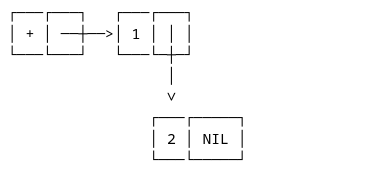

+++
title = 'Lisp'
date = 2024-01-14T05:11:03-03:00
+++

The name Lisp comes from **Lis**t **P**rocessing and that's just about what you really need to do some computation, lists!

If you think something here is wrong or if you want to chat about this, feel free to contact me on
<a href="https://mastodon.social/@fkinoshita" target="_blank" rel="me">Mastodon</a>,
<a href="https://matrix.to/#/@fkinoshita:gnome.org" target="_blank">Matrix</a>, or
send me <a href="https://letterbird.co/kinofhek" target="_blank">email</a>.

## Lists

Lisp represents (almost) everything as lists, these lists are not like C arrays, where everything is next to each other in memory and can only store a single data type. Lisp lists are actually linked lists, a chain of cells, all of which link to a value and to the next cell in the list.

These cells can contain any sort of value, be it a integer number, a string, a symbol ([what even are those?](#symbols)), etc.

<picture>
  <source srcset="images/linked_list_light.png" media="(prefers-color-scheme: light)"/>
  <source srcset="images/linked_list_dark.png"  media="(prefers-color-scheme: dark)"/>
  
</picture>

In Lisp we can represent the same list as in the previous image with the following code:

```
(+ 1 2)
```

And this is actually how we sum up two (or more numbers) in Lisp! The first element is interpreted as a function and the following elements are interpreted as the arguments to that function.

But by representing everything as lists we gain some superpower. By inserting a `'` (simple quote) in the beginning of some Lisp expression we tell Lisp to interpret it, not as code, but as data.

```
'(+ 1 2)
```

This expression, unlike the previous one, does not evaluate to 3 but instead represents the literal list containing the symbols +, 1, and 2. This allows us to manipulate code just like any other data structure in Lisp, we can get an specific element from the list, reverse it, add to it, you name it.

## Symbols

Symbols are just some identifier that we can reference later in our code, although symbols are implemented as a list of characters they are an atomic object, we can't get the first index of a symbol nor split it into smaller parts.

## Functions

As said in the previous section, Lisp represents (almost) everything as list and this includes functions!

Functions are just lists that contain the symbol `lambda` at the start:

```
(lambda (x)
  (+ x 1))
```

The second element is a list with the function parameters and the following elements are the function body. This previous example shows a function that expects a number `x` and returns `x` plus one.

You might recognize the word `lambda` from other programming languages, usually it means that something is a anonymous function. That meaning still applies to Lisp, we can use it the same as other functions, just like with the `+` function we saw earlier.

```
((lambda (x) (+ x 1)) 9)
```

Here we are passing `9` as an argument to this `lambda` we just created, evaluating it gives us `10`.

We can also give names to lambdas to make it easier to re-use them, each dialect of Lisp handles this differently. In [Common Lisp](https://common-lisp.net/downloads) we can give our lambda a name like this:

```
(defun plus-one (x)
  (+ x 1))
```

## Macros

Macros are what allow us to treat code as data, macros are very similar to functions and we can think of them as being almost the same thing.

A simple and silly example to show the power of macros is the following:

```
> (backwards (2 1 +))
3
```

`backwards` is a macro that takes in a backwards expression and interprets it as normal Lisp code, let's take a look at how it works:

```
(defmacro backwards (expression)
  (reverse expression))
```

Doesn't look so scary, right? It looks almost identical to the `plus-one` function we defined earlier, except that instead of `defun` we use `defmacro`. Then we use a common function `reverse` to reverse the passed list.

Another example of the use of macros is to make comparing numbers a bit less confusing, when comparing numbers in Lisp we will encounter something like the following code:

```
(< 8 9)
```

This is checking to see if 8 is less than 9, if you are not used to prefix notation this can be somewhat confusing, it takes a second to understand what is going on. Ideally we would like to type something like `8 < 9` or `10 > 1`.

Thanks to Lisp we can make our life easier by defining a macro to deal with this:

```
(defmacro compare (a op b)
  `(,op ,a ,b))

(compare 9 > 5)
```

As we can see there are a bunch of commas and a backtick, what are those symbols doing exactly?

The backtick is very similar to the simple quote we saw in previous sections, it's telling Lisp to interpret the following list as data and not code, but unlike the simple quote, the backtick allows us to evaluate elements inside it before treating them as data.

And that is what the commas are doing, evaluating each symbol before treating everything as data.

So we first create a literal list using the backtick, we then evaluate the symbols op, a, and b to be their actual values instead of the literal symbols 'op, 'a, and 'b.
